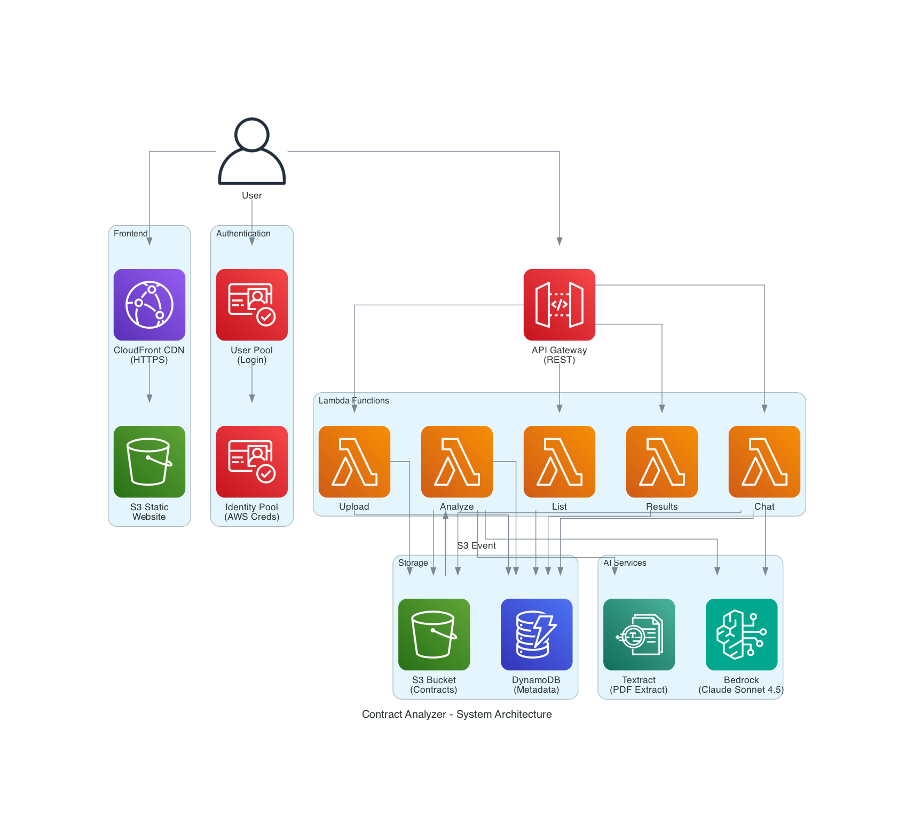

# AI-Powered Contract Analyzer

Intelligent contract analysis system using AWS services and Generative AI to extract insights, identify risks, and enable interactive Q&A with your contracts.

**⚡ Quick Start:** Deploy in 3 steps using AWS CloudShell - see [Deployment Guide](docs/DEPLOYMENT.md)



## 🎯 What It Does

- **Upload PDF Contracts** - Secure upload to S3 with user authentication
- **Automatic Analysis** - Extracts text with Textract, analyzes with Claude Sonnet 4.5
- **Structured Insights** - Key terms, commitments, contacts, deadlines, and risks
- **Interactive Chat** - Ask questions about your contracts using AI
- **Real-time Dashboard** - Track analysis status and view results

## 🏗️ Architecture

### Frontend
- **React** - Modern web interface
- **AWS Amplify** - Authentication and S3 uploads
- **CloudFront + S3** - Global CDN with HTTPS

### Backend
- **API Gateway** - REST API with Cognito authorization
- **Lambda Functions** - Serverless processing (Python 3.12)
- **DynamoDB** - Contract metadata and results
- **S3** - Contract storage with versioning

### AI Services
- **Amazon Textract** - PDF text extraction
- **Amazon Bedrock (Claude Sonnet 4.5)** - Contract analysis and chat
- **Strands Agents Framework** - Structured AI interactions

### Regional Deployment
- **Fully Region-Agnostic** - Deploy to any AWS region
- **Automatic Configuration** - All services configured for your chosen region
- **Bedrock Availability** - Ensure Claude Sonnet 4.5 is available in your target region
- **Recommended Regions** - us-east-1, us-west-2, eu-west-1, ap-southeast-1
- **Check Model Access** - Request access to Claude models in Bedrock console before deploying

## 💰 Cost Estimate

### Typical Usage Scenario (100 contracts/month)

**Assumptions:**
- 100 PDF contracts uploaded per month
- Average 10 pages per contract (1,000 pages total)
- 500 chat interactions per month
- 100 active users
- 10GB data transfer

| Service | Usage Details | Monthly Cost |
|---------|--------------|--------------|
| **Amazon Textract** | 1,000 pages × $1.50/1K pages | $1.50 |
| **Amazon Bedrock (Claude Sonnet 4.5)** | 100 analyses: ~2M input + 500K output tokens<br>500 chats: ~5M input + 1M output tokens | $22.40 |
| **AWS Lambda** | 600 invocations × 30 sec avg × 512MB-1GB | $0.50 |
| **Amazon S3** | 10GB storage + 2,000 requests | $0.30 |
| **Amazon DynamoDB** | 1M reads, 100K writes (on-demand) | $0.50 |
| **Amazon CloudFront** | 10GB data transfer + 50K requests | $0.90 |
| **Amazon API Gateway** | 10,000 API requests | $0.04 |
| **Amazon Cognito** | 100 active users (MAU) | Free |
| **Total** | | **~$26/month** |

### Bedrock Pricing Breakdown (Claude Sonnet 4.5)

**Model Pricing:**
- Input tokens: $0.003 per 1K tokens
- Output tokens: $0.015 per 1K tokens

**Contract Analysis (per contract):**
- Input: ~20K tokens (15K contract text + 5K prompt) = $0.06
- Output: ~5K tokens (structured analysis) = $0.075
- **Cost per analysis: ~$0.135**

**Chat Interaction (per message):**
- Input: ~10K tokens (contract context + history) = $0.03
- Output: ~2K tokens (response) = $0.03
- **Cost per chat: ~$0.06**

### Cost by Usage Tier

| Monthly Contracts | Textract | Bedrock | Other Services | **Total** |
|-------------------|----------|---------|----------------|-----------|
| **10 contracts** | $0.15 | $2.25 | $2.24 | **~$5/month** |
| **50 contracts** | $0.75 | $11.25 | $3.50 | **~$16/month** |
| **100 contracts** | $1.50 | $22.40 | $4.74 | **~$26/month** |
| **500 contracts** | $7.50 | $112.00 | $12.00 | **~$132/month** |
| **1000 contracts** | $15.00 | $224.00 | $20.00 | **~$259/month** |

### AWS Free Tier Benefits (First 12 months)

| Service | Free Tier | Value |
|---------|-----------|-------|
| **Lambda** | 1M requests + 400K GB-seconds/month | ~$13/month |
| **DynamoDB** | 25GB storage + 25 WCU + 25 RCU | ~$12/month |
| **S3** | 5GB storage + 20K GET + 2K PUT | ~$0.50/month |
| **CloudFront** | 1TB transfer + 10M requests | ~$85/month |
| **API Gateway** | 1M requests/month | ~$3.50/month |

**With Free Tier: Most services covered, pay only for Textract & Bedrock (~$24/month for 100 contracts)**

### Cost Optimization Tips

1. **Reduce Bedrock Costs (Biggest expense)**
   - Limit contract text to 10K tokens instead of 15K
   - Use shorter system prompts
   - Implement response caching for similar questions
   - **Potential savings: 30-40%**

2. **Reduce Textract Costs**
   - Only process first 20 pages of large contracts
   - Skip image-only pages
   - **Potential savings: 20-30%**

3. **Optimize Lambda**
   - Reduce memory allocation (currently 512MB-1GB)
   - Optimize cold start times
   - **Potential savings: 10-20%**

4. **Use S3 Intelligent-Tiering**
   - Automatically move old contracts to cheaper storage
   - **Potential savings: 40-50% on storage**

### Real-World Cost Examples

**Startup (10-20 contracts/month):**
- Monthly cost: $5-10
- Annual cost: $60-120
- Cost per contract: $0.50

**Small Business (50-100 contracts/month):**
- Monthly cost: $16-26
- Annual cost: $192-312
- Cost per contract: $0.26-0.32

**Enterprise (500+ contracts/month):**
- Monthly cost: $132+
- Annual cost: $1,584+
- Cost per contract: $0.26
- Consider Reserved Capacity for Bedrock

### Cost Monitoring

Set up billing alerts:
```bash
aws cloudwatch put-metric-alarm \
  --alarm-name contract-analyzer-cost \
  --alarm-description "Alert when monthly costs exceed $50" \
  --metric-name EstimatedCharges \
  --namespace AWS/Billing \
  --statistic Maximum \
  --period 21600 \
  --evaluation-periods 1 \
  --threshold 50 \
  --comparison-operator GreaterThanThreshold
```

## 🚀 Quick Start

### Automated Deployment (Recommended)

**Deploy everything with one command using AWS CloudShell:**

```bash
# 1. Open AWS CloudShell in your AWS Console
# 2. Clone and deploy:
git clone <your-repo-url>
cd contract-analyzer
./scripts/deployment/setup-and-deploy.sh
```

That's it! The script will:
- ✅ Automatically detect your AWS region from CloudShell
- ✅ Create and configure CodeBuild project
- ✅ Build Lambda layer with Strands framework
- ✅ Deploy all infrastructure (Lambda, API Gateway, DynamoDB, S3, CloudFront, Cognito)
- ✅ Build and deploy frontend automatically
- ✅ Show you the CloudFront URL when complete

**Total time:** 12-15 minutes (fully automated)

**📖 See [Deployment Guide](docs/DEPLOYMENT.md) for detailed instructions.**

---

### Manual Deployment (Alternative)

If you prefer to deploy manually or need more control:

#### Prerequisites
- AWS Account with CLI configured
- Node.js 18+ and npm
- Python 3.12+
- AWS CDK installed: `npm install -g aws-cdk`

#### 1. Deploy Backend

```bash
cd backend

# Install dependencies
pip install -r requirements.txt

# Build Lambda layer (Strands framework)
./build_layer.sh

# Deploy infrastructure to your preferred region
cdk deploy --region us-east-1
```

**Save the CDK outputs** (API URL, User Pool ID, etc.)

#### 2. Configure Frontend

The automated deployment generates `frontend/src/aws-config.js` automatically. For manual deployment, update it with CDK output values.

#### 3. Deploy Frontend

```bash
./deploy-frontend.sh
```

Your app will be live at the CloudFront URL! 🎉

## 📖 Usage

### 1. Sign Up / Login
- Create account with email and password
- Email verification required

### 2. Upload Contract
- Click "Upload Contract"
- Select PDF file (max 100MB)
- Upload starts automatically

### 3. View Analysis
- Wait for analysis to complete (~30-60 seconds)
- Click "View Details" to see results
- Review extracted insights

### 4. Chat with Contract
- Click the chat button (bottom-right)
- Ask questions about the contract
- Get AI-powered answers with citations

## 🔒 Security Features

- ✅ **Authentication** - Cognito User Pool with strong password policy
- ✅ **Authorization** - API Gateway Cognito authorizer on all endpoints
- ✅ **Data Isolation** - Users can only access their own contracts
- ✅ **Encryption** - Data encrypted at rest (S3, DynamoDB)
- ✅ **HTTPS** - All traffic encrypted in transit
- ✅ **Input Validation** - Filename sanitization, size limits
- ✅ **Rate Limiting** - 100 requests/second per user
- ✅ **Private Buckets** - No public access to S3
- ✅ **IAM Least Privilege** - Minimal permissions for each service

## 🛠️ Development

### Local Frontend Development

```bash
cd frontend
npm start
# Opens http://localhost:3000
```

### View Logs

```bash
# Lambda logs
aws logs tail /aws/lambda/ContractAnalyzerStack-AnalyzeFunction --follow

# API Gateway logs
aws logs tail /aws/apigateway/ContractAnalyzerApi --follow
```

### Update Backend

```bash
cd backend
cdk deploy
```

### Update Frontend

```bash
./deploy-frontend.sh
```

## 📊 Monitoring

### CloudWatch Dashboards
- Lambda execution metrics
- API Gateway requests/errors
- DynamoDB read/write capacity
- Bedrock invocations and costs

### Key Metrics to Watch
- **Lambda Errors** - Failed contract processing
- **API 4xx/5xx** - Client/server errors
- **Bedrock Costs** - AI usage costs
- **Textract Costs** - PDF processing costs

## 🐛 Troubleshooting

### Contract Analysis Stuck
- Check Lambda logs for errors
- Verify Bedrock model access
- Ensure Textract permissions

### Upload Fails
- Check file size (max 100MB)
- Verify S3 bucket permissions
- Check CORS configuration

### Chat Not Working
- Verify contract is analyzed
- Check extracted text exists in S3
- Review Lambda timeout settings

### Frontend Not Loading
- Check CloudFront distribution status
- Verify S3 bucket has files
- Check browser console for errors

## 📁 Project Structure

```
contract-analyzer/
├── README.md                    # This file
├── docs/                        # Documentation
│   ├── DEPLOYMENT.md            # Deployment guide
│   └── GUIDE.md                 # Feature guide
├── scripts/                     # All scripts
│   ├── deployment/              # Deployment automation
│   │   ├── setup-and-deploy.sh  # Main deployment script
│   │   ├── cleanup.sh           # Cleanup script
│   │   ├── buildspec.yml        # CodeBuild specification
│   │   └── codebuild-setup.yaml # CloudFormation template
│   └── generate-frontend-config.py
├── backend/                     # Backend infrastructure
│   ├── stacks/                  # CDK stacks
│   ├── lambda/                  # Lambda functions
│   └── lambda_layer/            # Strands framework
└── frontend/                    # React application
    └── src/components/          # React components
```

See [PROJECT_STRUCTURE.md](PROJECT_STRUCTURE.md) for detailed structure.

## 🔄 CI/CD (Optional)

### GitHub Actions Example

```yaml
name: Deploy
on:
  push:
    branches: [main]
jobs:
  deploy:
    runs-on: ubuntu-latest
    steps:
      - uses: actions/checkout@v2
      - name: Deploy Backend
        run: cd backend && cdk deploy --require-approval never
      - name: Deploy Frontend
        run: ./deploy-frontend.sh
```

## 🧹 Cleanup

To avoid ongoing AWS charges, run the cleanup script:

```bash
./scripts/deployment/cleanup.sh
```

This will delete:
- ✅ CDK Stack (Lambda, API Gateway, DynamoDB, S3, CloudFront, Cognito)
- ✅ CodeBuild Project
- ✅ S3 Buckets (including all uploaded contracts)
- ✅ All user data
- ✅ CloudWatch log groups

**Warning:** This is permanent and cannot be undone!

### Manual Cleanup (if needed)

If the cleanup script fails, you can manually delete resources:

```bash
# Delete CDK stack
aws cloudformation delete-stack --stack-name ContractAnalyzerStack --region $AWS_REGION

# Delete CodeBuild stack
aws cloudformation delete-stack --stack-name ContractAnalyzerCodeBuild --region $AWS_REGION

# Empty and delete S3 buckets
aws s3 rm s3://your-bucket-name --recursive
aws s3 rb s3://your-bucket-name
```

### Cost After Cleanup

After successful cleanup, you should see:
- ✅ No Lambda invocations
- ✅ No S3 storage charges
- ✅ No DynamoDB read/write charges
- ✅ No Bedrock API calls
- ✅ No CloudFront data transfer

**Note:** Some services may show minimal charges for the current billing period before cleanup. These will stop after resources are deleted.

## 🤝 Contributing

1. Fork the repository
2. Create a feature branch
3. Make your changes
4. Test thoroughly
5. Submit a pull request

---

**Built with ❤️ using AWS Serverless Technology and Kiro - A new Agentic IDE**
